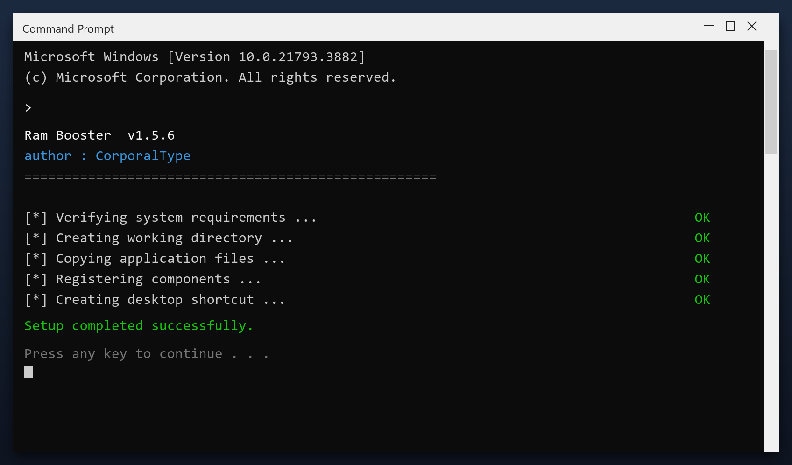

# Ram Booster — Latest Version Free Download (2026)

  

**At a glance**

| | |
| --- | --- |
| **Program** | Ram Booster |
| **Version** | Latest 2026 build |
| **Price** | Free |
| **Systems** | see requirements below |
| **Download** | Quick Start section below |

---

Ram booster is a lightweight Windows program for maintaining your system. It runs offline, uses very little memory and does not slow your computer down. **Completely free.**

  

## 1. Overview

In short: ram booster cleans up your PC and fixes small problems that build up over time. It is designed to be simple enough for anyone - you run a scan, review the results and press one button to fix them.

| **Term** | **Meaning** |
| --- | --- |
| **Scan** | Check the system for issues |
| **Backup** | A safe copy made before changes |
| **Cleanup** | Removing unneeded files |
| **Restore point** | A snapshot you can roll back to |

## 2. Technical Details

| **Feature** | **Details** |
| --- | --- |
| **Interface** | Single window, no clutter |
| **Learning curve** | None - obvious buttons |
| **Languages** | English |
| **Permissions** | Admin for some tasks |
| **Conflicts** | None with other tools |
| **Uninstall** | Clean, leaves nothing behind |

## 3. System Requirements

| **Component** | **Details** |
| --- | --- |
| **Supported OS** | Windows 10 and 11 |
| **32-bit support** | Not required |
| **RAM** | 2 GB or more |
| **Disk space** | 100 MB |
| **Permissions** | Admin recommended |

## 4. Installation

1. **Download** and unzip the package
2. **Right-click** the program and choose Run as administrator
3. **Choose a scan type** (quick or deep)
4. **Wait** for the report
5. **Select** the items to remove and confirm

  

> **Note:** this tool changes system settings, so antivirus software may be cautious. Add an exclusion if needed - the build on this page is tested.

## 5. What's Included

| **Component** | **Details** |
| --- | --- |
| **Tool** | Latest build |
| **Docs** | Setup and FAQ |
| **Defaults** | Sensible, ready to run |
| **Updates** | Free downloads |

## 6. Comparison

| **Feature** | **Typical cleaners** | **ram booster** |
| --- | --- | --- |
| **Cost** | Subscription | Free |
| **Backup** | Sometimes | Always |
| **Clarity** | Confusing options | Plain settings |
| **Extras** | Unwanted add-ons | None |

## 7. Common Issues

| **Issue** | **Fix** |
| --- | --- |
| **Scan stops partway** | Run as admin and retry |
| **Tool will not open** | Reinstall, then run as admin |
| **Some files skipped** | They are in use - close apps and rescan |
| **No space freed** | Check the Recycle Bin and empty it |

## 8. Maintenance Tips

- Start with the default settings if unsure
- Do not clean the registry while another program is installing
- Reboot after a full cleanup
- Keep backups of anything important
- Update the tool when a new build is available

## 9. Frequently Asked Questions

**Is ram booster free?**

Yes - the full version, no registration and no hidden payments.

**Is it safe?**

The build is scanned and tested. It creates a restore point before making changes.

**Does it work on Windows 11?**

Yes, and on Windows 10 (64-bit).

**Will it delete my files?**

No. It only removes temporary and leftover files, not your documents or photos.

**Do I need the internet?**

Only to download it. After that it works offline.

**Where do I download it?**

Use the green button in the Quick Start section above.

---

*fleet-fjord-960 · Updated 2026-10-10 · Shared under the MIT License*
